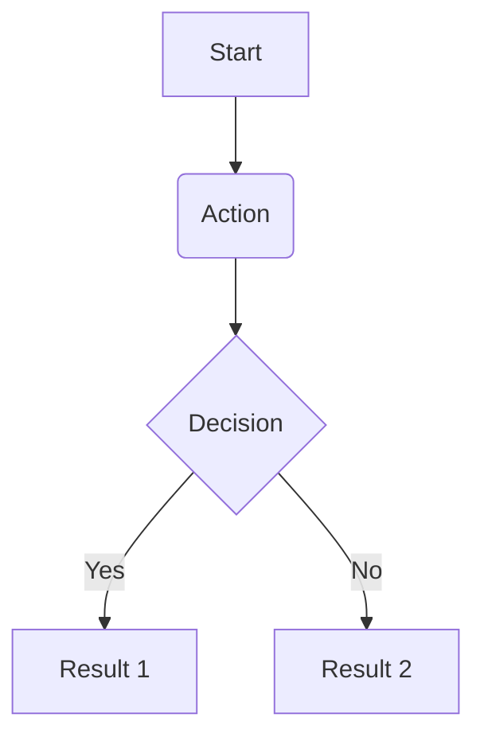

# Plan: {SPEC_NUMBER} - {TITLE}

## 1. 접근 방법론 (Approach)
어떤 방식으로 `spec.md`의 요구사항을 해결할 것인지 기술합니다.
(필요하다면 디자인 패턴, 라이브러리 도입, 코드 분리 전략 등 포함)

## 2. 아키텍처 / 시스템 흐름 (Mermaid Graph)
복잡한 데이터의 흐름이나 컴포넌트 구조 변경이 있다면 반드시 Mermaid 그래프를 그려서 설명합니다.

## 3. 디렉토리/파일 변경 계획
- `[NEW]` `/src/new-file.py` - (파일 역할)
- `[MODIFY]` `/src/existing.py` - (수정할 내용)
- `[DELETE]` `/src/old.py`

## 4. 테스트 전략 (Testing Strategy)
- Unit Test 관점: (어떤 함수/모듈에 대한 input/output 테스트를 작성할 것인가)
- Integration Test 관점: (어떤 환경을 띄워서 API나 DB까지 연동하여 검증할 것인가)
