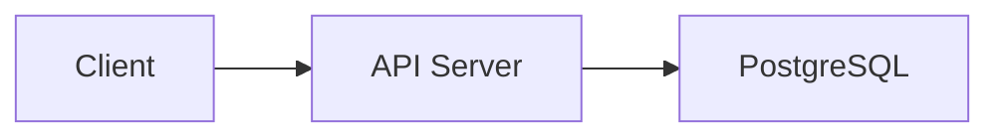

# PR: {SPEC_NUMBER} - {TITLE}

## 1. 개요 (Description)
- 어떤 변경 사항이 있는지, 이 PR의 목적이 무엇인지 간략히 적습니다.
- 관련 지라 티켓이나 스펙 링크를 걸어주세요. (예: Resolves #`SPEC_NUMBER`)

## 2. 작업 상세 내용 (Changes)
- [ ] (주요 변경점 1)
- [ ] (주요 변경점 2)

## 3. 아키텍처 및 로직 흐름 (Mermaid)
> 리뷰어가 코드를 쉽게 파악할 수 있도록 핵심 로직을 시각화합니다. (Plan이나 Walkthrough에 있는 걸 가져와도 됨)

## 4. 테스트 결과 및 체크리스트 (Testing Checklist)
- [ ] 유닛 테스트를 추가하고 모두 통과했습니다.
- [ ] 머지 대상 브랜치에서 통합 테스트가 이상 없음을 확인했습니다.
- [ ] Linting 룰과 포맷 규칙을 준수했습니다.

## 5. 리뷰어에게 (To Reviewers)
- 추가로 중점적으로 봐야 할 코드 라인이나 고민이 필요한 지점(Open Questions) 작성.
