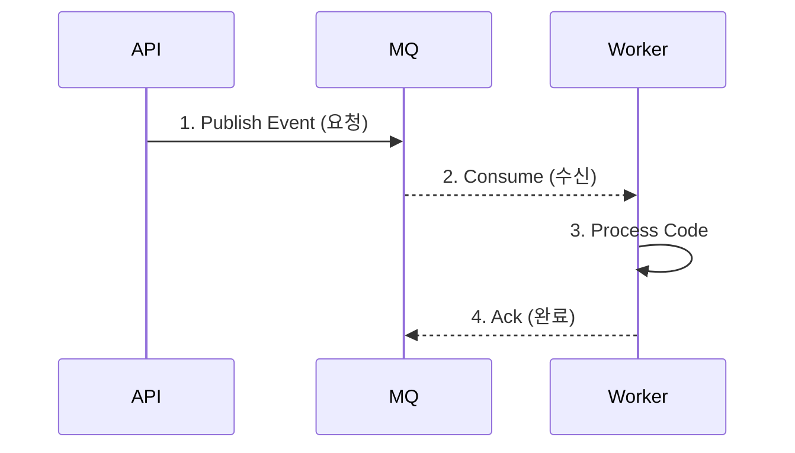

# Walkthrough: {SPEC_NUMBER} - {TITLE}

> 이 문서는 개발 과정 전반을 실시간으로 기록하는 "개발 일지(Developer Log)"입니다. 
> Agent는 에러가 발생했거나, 중요한 고민을 했거나, 흐름이나 상태를 정의할 때 이 문서를 즉시 업데이트해야 합니다.

## 1. Thought Process (사고 과정)
- **Problem**: (예: API에서 DB 응답을 기다릴 때 타임아웃이 발생함)
- **Alternative 1**: (시도해 볼 수 있는 방법 1)
- **Alternative 2**: (시도해 볼 수 있는 방법 2)
- **Decision & Why**: (어떤 방식을 선택했고, 왜 그런 결정을 내렸는지)

## 2. 상태 전이 및 로직 다이어그램 (Mermaid)

(설계한 워크의 흐름이나 상태 전이도가 있다면 아래에 Mermaid 구문으로 시각화합니다.)

## 3. 에러 해결 로그 (Troubleshooting)
- **발생 시점**: Task 체크박스 `[ ] 기능 A 구현` 도중
- **에러 메시지**: `ConnectionRefusedError: ...`
- **원인 / 추론**: DB 컨테이너가 Healthy 상태가 되기 전에 연결 시도
- **해결 방법**: `docker-compose.yml`에서 `depends_on` 에 `condition: service_healthy` 추가
