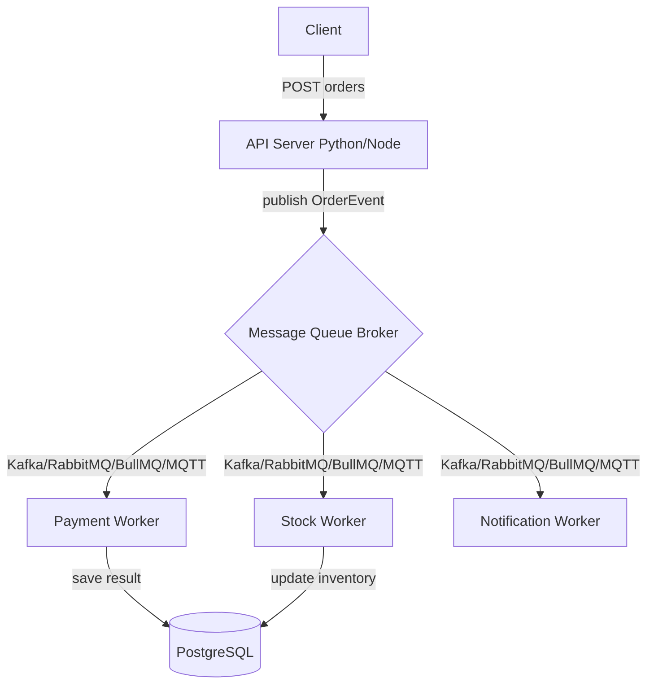

# Architecture Overview: Ecommerce 주문 처리 파이프라인

이 문서는 프로젝트의 전체 아키텍처와 이벤트 흐름을 설명합니다. 본 프로젝트는 동일한 비즈니스 로직을 유지한 채 메시지 큐(MQ) 계층만 교체하여 기술적 차이를 정량적으로 실험하는 것을 목표로 합니다.

## 1. 전제 시스템 구조
시스템은 크게 **API 서버(Producer)**, **Message Queue(Broker)**, **Worker(Consumer)**, 그리고 **데이터베이스**로 구성됩니다.

## 2. 핵심 설계 철학: MQ 추상화 (Adapter Pattern)
서로 다른 프로콜과 동작 방식을 가진 4종의 MQ를 원활하게 교체하기 위해 `BaseQueue` 인터페이스를 정의하였습니다.

- **Interface 구성**:
    - `connect()`: 각 MQ 브로커와의 커넥션 확립.
    - `publish(event: OrderEvent)`: 주문 이벤트를 토픽/큐로 발행.
    - `consume(handler)`: 브로커로부터 이벤트를 수신하여 비즈니스 로직으로 전달.

이 추상화 덕분에 API 서버와 Worker의 메인 로직은 MQ의 종류가 무엇인지 알 필요가 없으며, 설정값 하나로 전체 인프라 기술셋을 스위칭할 수 있습니다.

## 3. 이벤트 기반 시나리오 흐름
1. 클라이언트가 `/orders` API를 호출합니다.
2. API 서버는 고유 ID(UUID)와 현재 UTC 시간을 포함한 `OrderEvent` 객체를 생성합니다.
3. 생성된 이벤트는 선택된 MQ 어댑터를 통해 브로커로 발행됩니다.
4. 각 Worker는 구독 중인 MQ로부터 이벤트를 수신합니다.
5. Worker는 비즈니스 로깅을 수행하고 처리 시간을 기록하여 최종 성능 지표를 도출합니다.
