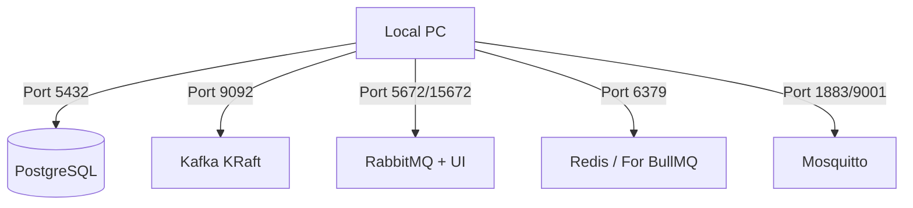

# Plan: 1-001 - 인프라 기반 구축 (Infra MVP)

## 1. 접근 방법론 (Approach)
- `docker-compose.yml`을 프로젝트 최상단에 하나 구성하여 모든 인프라를 하나로 관리합니다.
- DB 초기화 구문은 `db/init.sql` 파일에 작성하고, PostgreSQL Docker 이미지의 `/docker-entrypoint-initdb.d/` 디렉토리에 bind mount 시켜 컨테이너 기동 시 자동 테이블 생성을 유도합니다.

## 2. 아키텍처 / 시스템 흐름 (Mermaid Graph)
이번 단계는 애플리케이션 데이터 파이프라인 없이 백연드 인프라만 구성하는 형태입니다.

## 3. 디렉토리/파일 변경 계획
- `[NEW]` `/docker-compose.yml` - 인프라 전체 관장 파일
- `[NEW]` `/db/init.sql` - 테이블(`orders`, `event_logs`) 초기 생성 DDL 스크립트

## 4. 테스트 전략 (Testing Strategy)
- Integration Test (수동 로컬 검증):
  1. `docker compose up -d` 후 `docker ps` 에서 `healthy` 상태 점검.
  2. DBeaver나 `psql` 을 활용하여 `localhost:5432`로 DB 접속 성공 및 테이블 존재 여부 확인.
  3. `http://localhost:15672` (RabbitMQ Management) 브라우저 접속 확인.
