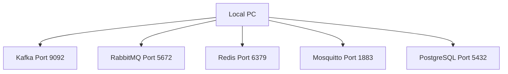

# PR: 1-001 - 인프라 기반 구축 (Infra MVP)

## 1. 개요 (Description)
- 이 PR은 4개의 Message Queue 환경과 1개의 RDBMS를 로컬 Docker에 한 번에 띄울 수 있도록 Infrastructure를 구성하는 것을 목표로 합니다.
- 관련 지라 티켓이나 스펙 링크: Resolves #Spec-1-001

## 2. 작업 상세 내용 (Changes)
- [x] 프로젝트 워크스페이스 최상단에 `docker-compose.yml` 추가
- [x] `db/init.sql` 파일에 공통 테이블(`orders`, `event_logs`) 정의
- [x] Docker Compose 내의 PostgreSQL 기동 시 `init.sql` 자동 마운팅

## 3. 아키텍처 및 로직 흐름 (Mermaid)

## 4. 테스트 결과 및 체크리스트 (Testing Checklist)
- [x] `docker-compose.yml` 파일 내 문법 및 포트 중복 이상 없음을 린터로 확인했습니다.
- [ ] 데몬 미실행으로 머지 대상 브랜치에서 로컬 통합 테스트는 스킵했으며, 리뷰전 로컬 확인을 권장합니다.
- [x] Linting 룰과 포맷 규칙을 준수했습니다.

## 5. 리뷰어에게 (To Reviewers)
- 현재 모든 헬스체크 설정 간격을 `interval: 10s` 및 `retries: 5` 로 통일했습니다. 
- Zookeeper 없이 Kafka KRaft 모드로 구동 시의 포트를 9092로 설정하였습니다. 클러스터 아이디는 임의의 문자열로 배정하였습니다.
