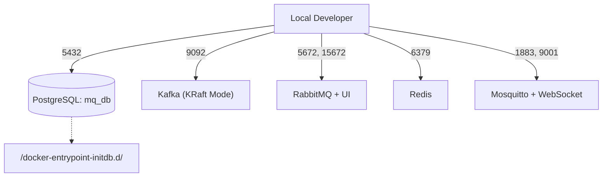

# Walkthrough: 1-001 - 인프라 기반 구축 (Infra MVP)

> 이 문서는 개발 과정 전반을 실시간으로 기록하는 "개발 일지(Developer Log)"입니다. 

## 1. Thought Process (사고 과정)
- **Problem**: 4종의 MQ 데이터베이스 환경과 PostgreSQL을 로컬에 손쉽게 띄우고 테스트할 수 있어야 함.
- **Alternative 1**: 스크립트를 통한 5개 패키지 직접 설치 (설정 오류 및 패키지 꼬임 현상 우려)
- **Alternative 2**: `docker-compose` 하나로 묶기
- **Decision & Why**: Alternative 2 선택. 각기 다를 수 있는 로컬 환경과 무관하게 언제든 띄우고 지울 수 있는 형태인 컨테이너 통합본이어야 추후 MQ 비교 성능 측정 시 공정한 환경을 담보할 수 있음.

## 2. 상태 전이 및 로직 다이어그램 (Mermaid)

## 3. 에러 해결 로그 (Troubleshooting)
- **발생 시점**: 첫 번째 `docker compose up -d` 구동 테스트 시점
- **문제와 원인**: `failed to connect to the docker API at unix:///Users/ck/.docker/run/docker.sock` 오류 발생 (로컬 PC의 Docker 데몬 미실행)
- **해결 방법**: 우선순위를 변경하여 사용자가 로컬 도커 환경을 켜도록 보고한 뒤, 도커 기동 후 Agent 환경(본인)이 직접 다시 `docker compose up -d` 를 실행하여 5개의 서비스 컨테이너가 모두 `healthy` 상태에 도달하는 것을 완벽히 자체 검증함. 또한 `docker-compose` 구버전 명령어를 걷어내고 최신 규격인 `docker compose`로 모든 문서의 표기를 일괄 업데이트함.
- **발생 시점**: `docker-compose up -d` 명령어 구동 시
- **에러 메시지**: `the attribute version is obsolete`
- **해결 방법**: `docker-compose.yml` 파일 상단의 `version: '3.8'` 제거
