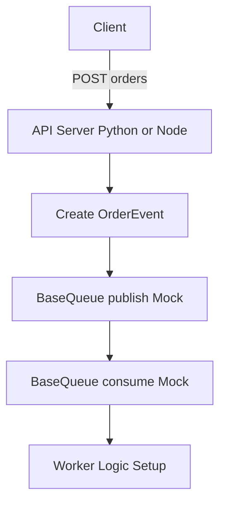

# Plan: 1-002 - 애플리케이션 코어 및 공통 인터페이스 설계 (Core MVP)

## 1. 접근 방법론 (Approach)
어댑터 패턴(Adapter Pattern)을 활용하여 구체적인 분산 큐 시스템 의존성을 분리합니다. `BaseQueue` 인터페이스를 정의하고 공통 스키마 `OrderEvent`를 사용합니다.

## 2. 아키텍처 / 시스템 흐름 (Mermaid Graph)

## 3. 디렉토리/파일 변경 계획
- `[NEW]` `/api-server/python/main.py` - FastAPI 주문 API 뼈대
- `[NEW]` `/api-server/node/src/main.ts` - Node.js Express 주문 API 뼈대
- `[NEW]` `/workers/python/base_queue.py` - Python Pydantic 모델 및 공통 Queue 인터페이스
- `[NEW]` `/workers/node/src/base-queue.interface.ts` - TypeScript 모델 및 공통 Queue 인터페이스

## 4. 테스트 전략 (Testing Strategy)
- Unit Test 관점: Pydantic 및 TS Interface 모델의 스키마 유효성 테스트 (필드 체크)
- Integration Test 관점: API 서버를 로컬에서 구동한 뒤 HTTP 기반 API 테스트 수동 수행
