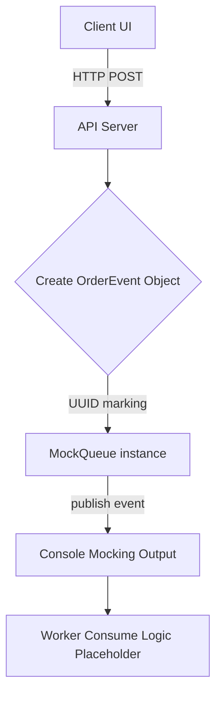

# PR: 1-002 - 애플리케이션 코어 및 공통 인터페이스 설계 (Core MVP)

## 1. 개요 (Description)
이 PR은 **Phase 1의 "Spec 1-002"** 요구사항을 해결합니다. 
진행 중인 이커머스 메시지 큐 시나리오 처리에서 향후 Kafka, RabbitMQ, BullMQ, MQTT 등 4가지 서로 다른 분산 큐 시스템을 플러그인 형태로 원활하게 교체하기 위해, 코어 뼈대가 되는 공통 인터페이스(어댑터 패턴 구조)와 API 서버를 마련했습니다.

- 관련 스펙: [Spec 1-002: 애플리케이션 코어 및 공통 인터페이스 설계](../../backlog/phase1.md)
- 영향을 받는 도메인: Python 상의 FastAPI 서버 & Node.js 상의 Express 서버 기초 구조

## 2. 작업 상세 내용 (Changes)
- [x] Python(FastAPI) 및 Node.js(Express) 기반 API 서버 스캐폴딩 설정 및 환경 세팅 구축 완료
- [x] Python `BaseQueue` 인터페이스 정의 (추상 클래스 `abc.ABC` 사용, Pydantic 기반의 `OrderEvent` 스키마 맵핑 적용)
- [x] Node.js `BaseQueue` 및 `OrderEvent` 타입스크립트 인터페이스 정의
- [x] 각 API 서버 POST `/orders` REST 경로 생성 및 응답 페이로드 Mock 인스턴스 전송 연동 (이벤트 생성 후 각 언어별 로컬 MockQueue 콘솔 로그에 전달됨)
- [x] 이벤트 누락 방지와 latency 분석을 위한 데이터 모델 내 `publishedAt` 기준 시간 타임스탬프 탑재 (Python: `datetime.now(timezone.utc)`, Node.js: `new Date()`)

## 3. 아키텍처 및 로직 흐름 (Mermaid)
> 주문 API 수신 시 클라이언트 데이터를 Mock 큐로 전달하는 기초 코어 시스템의 흐름입니다. 추후 MockQueue 자리에 실제 MQ 어댑터가 대체될 예정입니다.

## 4. 테스트 결과 및 체크리스트 (Testing Checklist)
- [x] Python: uvicorn 기반 API 서버 로컬 실행 및 HTTP 통신으로 Mock 로깅 확인
- [x] Node.js: tsx 기반 Express 구동 및 cURL HTTP 통신 Mock 로깅 확인
- [x] Python 상 Ruff 기본 린팅 경고 해소 및 모듈 레벨 Type Import 규칙 준수 수정 패스 완료
- [x] TypeScript Module/CommonJS 호환성 및 node 모듈 린트 경고 해결 (`NodeNext` 의존성이 아닌 명시적 Import/Type Only 규격 활용하여 충돌 방지)

## 5. 리뷰어에게 (To Reviewers)
- 현재 제공되는 `MockQueue` 클래스는 단순하게 콘솔을 찍는 형태로 구현되어 있습니다. Phase 2 작업 시 현재 인터페이스를 상속받은(KafkaMq, RabbitMq 등) 별도 드라이버 클래스로 갈아끼우는 형태로 작동하게 됩니다. 
- 현재 Data Model의 `items`가 `list[str]` 속성을 지니는데, 추후 가격이나 수량 등의 구조 확장이 필요해진다면 어떤 방식으로 확장 스펙을 설계해둘지 의견 주시면 반영하겠습니다.
