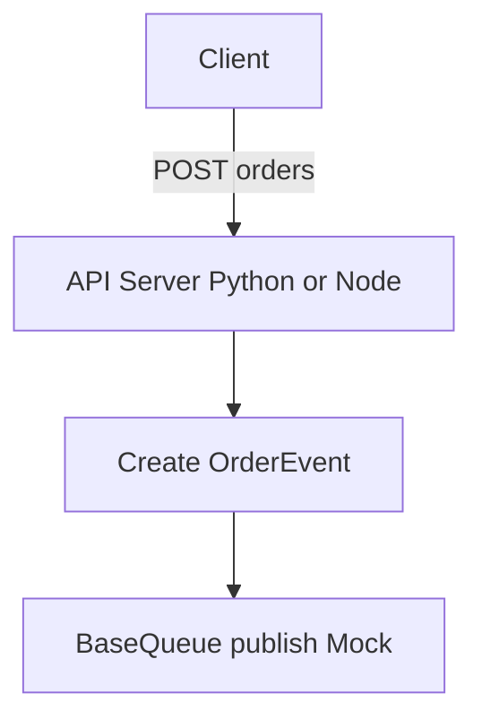

# Walkthrough: 1-002 - 애플리케이션 코어 및 공통 인터페이스 설계 (Core MVP)

## 변경 사항 요약
- **Python**: `pydantic` 기반 `OrderEvent` 스키마 및 `abc.ABC` 기반 `BaseQueue` 인터페이스 정의. `FastAPI` 기반 API 서버 추가 및 Mock 처리 테스트.
- **Node.js**: TypeScript 기반 `OrderEvent`, `BaseQueue` 인터페이스 구축. `Express` 기반 API 서버 추가 및 Mock 처리 테스트.
- **공통**: 이커머스 결제 데모 로직을 위한 POST `/orders` 요청 수신 및 MockQueue 콘솔 로깅 등 기본 뼈대 마련 완료.

## 아키텍처 흐름

## 검증 결과
- Python FastAPI: `curl -X POST http://localhost:8000/orders -H "Content-Type: application/json" -d '{"amount":100, "items":["item1"]}'` 호출 시 `{ "status": "success", "event": {...} }` 응답 성공
- Node.js Express: `curl -X POST http://localhost:3000/orders ...` 호출 시 동일 규격의 데이터 리턴 확인
