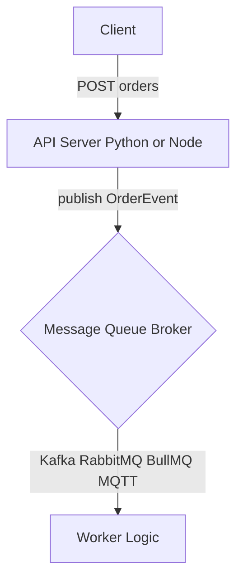

# PR: 1-003 - 아키텍처 구조 문서화 (Docs)

## 1. 개요 (Description)
본 PR은 **Phase 1의 "Spec 1-003"** 요구사항을 완료합니다. 
진행 중인 이커머스 메시지 큐 시나리오 처리 프로젝트의 핵심 구조를 문서화하고, 사용자 요청에 따라 **4종의 MQ(Kafka, RabbitMQ, BullMQ, MQTT) 간의 기술적 특징과 트레이드오프**를 비교 분석하는 지식 베이스를 구축했습니다.

- 관련 스펙: [Spec 1-003: 아키텍처 구조 문서화](../../backlog/phase1.md)
- 영향을 받는 디렉토리: `docs/architecture/`, `README.md`

## 2. 작업 상세 내용 (Changes)
- [x] **전체 아키텍처 명세**: `docs/architecture/overview.md`
    - 시스템 전체 레이아웃 및 이벤트 발행/소비 구조 시가화 및 MQ 추상화(Adapter Pattern) 설계 철학 공유.
- [x] **인프라 구동 가이드**: `docs/architecture/infrastructure.md`
    - `docker-compose` 구동 방법과 컨테이너 헬스체크 확인법, 각 API 서버별 실행 명령어 및 포트 테이블 명시.
- [x] **MQ 기술 심층 비교**: `docs/architecture/mq-comparison.md`
    - Kafka, RabbitMQ, BullMQ, MQTT의 장단점 및 트레이드오프 분석을 통한 설계 근거 마련.
- [x] **이벤트 스키마 및 Latency 측정 원리**: `docs/architecture/event-schema.md`
    - 공용 `OrderEvent` 규격과 성능 지표 도출 공식 정의.
- [x] **README.md 업데이트**: 메인 화면에서 신규 문서로 접근 가능한 링크 추가.

## 3. 아키텍처 및 로직 흐름 (Mermaid)

## 4. 테스트 결과 및 체크리스트 (Testing Checklist)
- [x] 문서 내 모든 Mermaid 다이어그램이 파싱 에러 없이 렌더링됨을 확인.
- [x] `README.md` 가독성 개선 및 경로 유효성 검사 완료.
- [x] 인프라 가이드의 실행 명령어가 로컬 환경과 일치함을 검증.

## 5. 리뷰어에게 (To Reviewers)
- 단순 사양 나열을 넘어 **"왜 Kafka를 항상 쓰지 않는가?"**에 대한 설명이 포함되어 있으므로, 향후 Phase 2 구현 시 이를 바탕으로 각 MQ의 장점을 극대화하는 방향으로 코딩 작업을 진행할 예정입니다.
