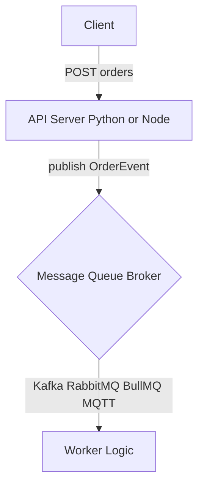

# Walkthrough: 1-003 - 아키텍처 구조 문서화 (Docs)

## 변경 사항 요약
- **시스템 아키텍처 가이드 구축**: `docs/architecture/overview.md`를 통해 프로젝트 전체의 데이터 흐름과 어댑터 패턴 설계 철학을 문서화함.
- **인프라 실행 매뉴얼**: `docs/architecture/infrastructure.md`에 Docker 컴포즈 구동법 및 각 언어별(Python, Node.js) API 서버 포트 정보를 명시함.
- **MQ 기술 비교 분석**: `docs/architecture/mq-comparison.md`를 추가하여 Kafka, RabbitMQ, BullMQ, MQTT의 장단점 및 트레이드오프를 상세히 정리함.
- **이벤트 스키마 및 성능 측정 가이드**: `docs/architecture/event-schema.md`에 `OrderEvent` 규격과 지연 시간(Latency) 측정 공식을 정의함.
- **접근성 개선**: `README.md` 메인 화면에 신규 생성된 문서들에 대한 링크를 연동함.

## 아키텍처 시각화 (Mermaid)

## 검증 내역
- [x] 각 문서 내 Mermaid 다이어그램 렌더링 정상 확인.
- [x] `README.md` 내 사이드 링크 이동 및 경로 유효성 검사 완료.
- [x] 인프라 가이드에 명시된 명령어가 실제 환경과 일치하는지 재검토함.
