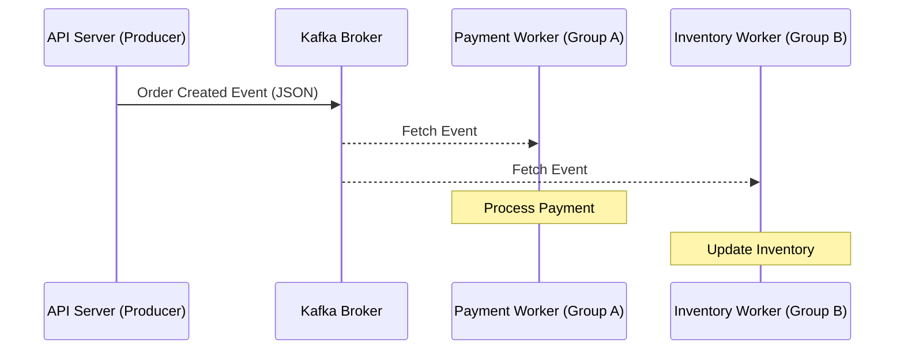

# Plan: 2-001 - Kafka 구현 (Kafka MVP)

## 1. 접근 방법론 (Approach)
- **토픽 관리 전략 (Auto-creation)**: 초기 개발 속도를 위해 Kafka Broker의 `KAFKA_AUTO_CREATE_TOPICS_ENABLE: "true"` 설정을 활용한 **자동 생성 방식**을 채택합니다. 생산자가 메시지를 보낼 때 토픽이 존재하지 않으면 자동으로 생성됩니다.
- Python은 `aiokafka`, Node.js는 `kafkajs` 라이브러리를 사용하여 비동기 생산자/소비자 구현.
- **DB 연동**: PostgreSQL을 `SQLAlchemy`(Python) 및 `Prisma` 또는 `pg`(Node)로 연동하여 처리 로그를 저장합니다.
- 공통 메시지 포맷은 `docs/architecture/event-schema.md`를 따름.

## 2. 아키텍처 / 시스템 흐름 (Mermaid Graph)

## 3. 디렉토리/파일 변경 계획
- `[MODIFY]` `api-server/python/main.py` - `MockQueue`를 실제 `KafkaProducer`로 교체
- `[NEW]` `workers/python/kafka_worker.py` - Python Kafka Consumer & DB 저장 로직
- `[NEW]` `workers/node/src/kafka.worker.ts` - Node.js Kafka Consumer & DB 저장 로직
- `[MODIFY]` `docker-compose.yml` - Kafka 토픽 자동 생성 활성화 확인 및 가이드 추가
- `[NEW]` `docs/architecture/schema.sql` - `processed_events` 테이블 스키마 정의

## 4. 테스트 전략 (Testing Strategy)
- Unit Test: 메시지 파싱 및 도메인 로직 처리 유닛 테스트.
- Integration Test: `docker-compose`로 Kafka를 실행한 상태에서 Producer(API) 호출 후 워커 로그에서 두 그룹의 수신 여부 확인.

