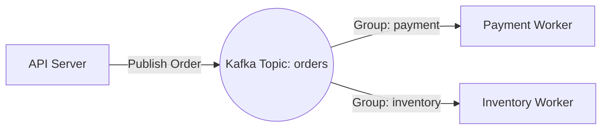

# Spec: 2-001 - Kafka 구현 (Kafka MVP)

## 1. 개요 (Overview)
- **목표**: Kafka 브로커 위에서 파이프라인을 구축하고, Consumer Group을 통한 독립적 이벤트 소비 개념을 검증한다.
- **영향 범위**: `workers/python/kafka_worker.py`, `workers/node/src/kafka.worker.ts`, `api-server/`
- **관련 지표/이슈**: Phase 2 로드맵의 첫 번째 단계.

## 2. 상세 요구사항 (Requirements)
- [ ] API 서버(Python)에 Kafka Producer(`aiokafka`) 연동 및 `orders` 토픽 발행 기능 구현
- [ ] Python (`aiokafka`)를 사용한 Kafka Worker 구현 (Topic: `orders`, Group: `payment-group`)
- [ ] Node.js (`kafkajs`)를 사용한 Kafka Worker 구현 (Topic: `orders`, Group: `inventory-group`)
- [ ] 각 Worker는 수신한 이벤트를 PostgreSQL DB(`processed_events` 테이블)에 저장해야 함.
- [ ] 동일한 메시지가 두 독립적인 그룹에 의해 동시에 소비되고 DB에 각각 기록되는지 검증.

## 3. 제약사항 및 비기능 요구사항
- 브로커 연결 정보는 환경 변수(`KAFKA_BOOTSTRAP_SERVERS`)를 통해 관리.
- Docker Compose로 띄워진 Kafka 인프라 활용.
- 메시지는 JSON 포맷으로 통일 (`event-schema.md` 준수).

## 4. 인수 조건 (Acceptance Criteria)
- **Scenario 1**: 다중 Consumer Group 소비 및 DB 영속화 검증
  - **Given**: Kafka 및 PostgreSQL이 실행 중이고, `processed_events` 테이블이 준비됨.
  - **When**: API를 통해 주문을 생성하여 `orders` 토픽에 메시지가 발행됨.
  - **Then**: `payment-group`(Python)과 `inventory-group`(Node)이 각각 이벤트를 수신하여 DB에 처리 결과를 남김 (총 2개의 Row 생성 확인).

## 5. 참고 자료 (References)

