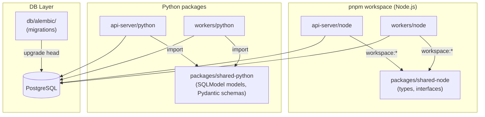
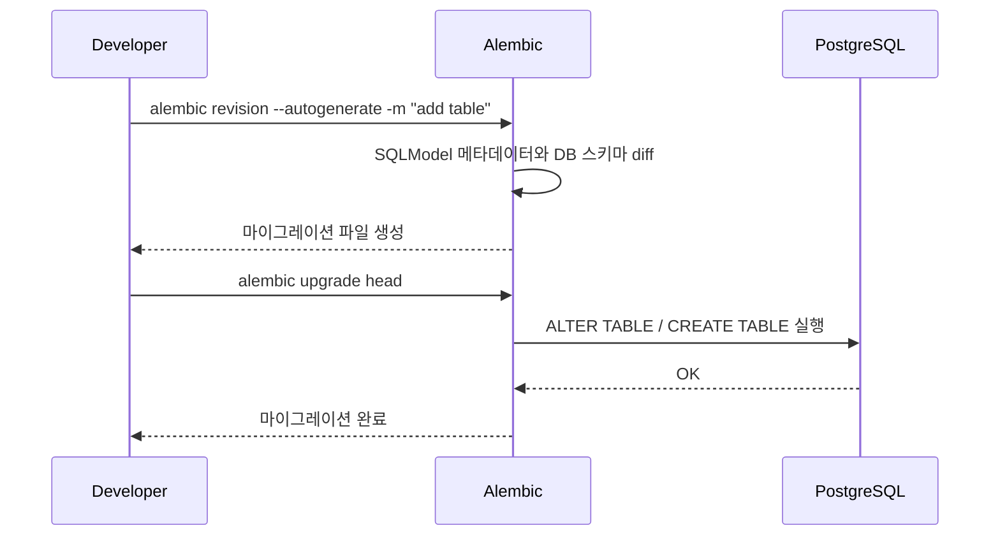

# Plan: 2-002 - 아키텍처 표준화 및 기록 (Standardization)

## 1. 접근 방법론 (Approach)

세 가지 축으로 나누어 순차 진행한다:

### 1-1. pnpm workspace 모노레포화
- 루트에 `pnpm-workspace.yaml`을 생성하여 `api-server/node`, `workers/node`를 workspace 패키지로 등록
- 공통 타입/인터페이스(`OrderEvent`, `BaseQueue`)를 `packages/shared-node`로 추출
- 루트 `tsconfig.base.json`에 공통 컴파일러 옵션을 정의하고, 각 패키지의 `tsconfig.json`이 이를 상속
- workspace 프로토콜(`workspace:*`)로 내부 의존성 연결

### 1-2. Python 공통 모델 통합 + Alembic 도입
- `packages/shared-python/`에 `models.py`(SQLModel 기반)와 `schemas.py`(Pydantic 이벤트 스키마)를 배치
- `api-server/python`과 `workers/python`에서 이 공통 패키지를 import하도록 리팩토링
- `db/alembic/`에 Alembic 환경을 구성하고, `init.sql`의 스키마를 초기 마이그레이션으로 변환
- docker-compose에서 DB 초기화 시 Alembic을 사용하도록 전환

### 1-3. Node.js DB 접근 개선 + ADR 기록
- 현재 `workers/node`의 raw SQL을 타입 안전한 패턴으로 개선 (Prisma 또는 타입화된 쿼리 헬퍼)
- 모든 기술 결정을 ADR로 문서화

## 2. 아키텍처 / 시스템 흐름 (Mermaid Graph)

### 모노레포 패키지 의존성 구조

### Alembic 마이그레이션 워크플로

## 3. 디렉토리/파일 변경 계획

### 프로젝트 루트
- `[NEW]` `pnpm-workspace.yaml` — workspace 패키지 경로 정의
- `[NEW]` `tsconfig.base.json` — 공통 TypeScript 설정
- `[MODIFY]` `docker-compose.yml` — DB 초기화 방식 변경 (init.sql → Alembic)
- `[MODIFY]` `.gitignore` — alembic 캐시, node_modules 등 추가 확인

### packages/shared-node/
- `[NEW]` `package.json` — workspace 패키지 메타데이터
- `[NEW]` `tsconfig.json` — base 상속
- `[NEW]` `src/types.ts` — `OrderEvent`, `ProcessedEvent` 공통 타입
- `[NEW]` `src/base-queue.interface.ts` — `BaseQueue` 인터페이스 (workers/node에서 이동)
- `[NEW]` `src/index.ts` — 배럴 export

### packages/shared-python/
- `[NEW]` `__init__.py`
- `[NEW]` `models.py` — `ProcessedEvent` SQLModel (api-server/python/common/models.py에서 이동)
- `[NEW]` `schemas.py` — `OrderEvent` Pydantic 스키마 (workers/python/base_queue.py에서 추출)

### db/alembic/
- `[NEW]` `alembic.ini` — Alembic 설정
- `[NEW]` `env.py` — SQLModel 메타데이터 바인딩
- `[NEW]` `versions/001_initial_schema.py` — init.sql 내용을 마이그레이션으로 변환

### 기존 파일 수정
- `[MODIFY]` `api-server/python/main.py` — 공통 모델 import 경로 변경
- `[MODIFY]` `api-server/python/common/models.py` — shared-python으로 이동 후 re-export 또는 삭제
- `[MODIFY]` `workers/python/base_queue.py` — OrderEvent를 shared-python에서 import
- `[MODIFY]` `workers/python/kafka_worker.py` — import 경로 변경
- `[MODIFY]` `api-server/node/package.json` — shared-node 의존성 추가
- `[MODIFY]` `api-server/node/tsconfig.json` — base 상속으로 전환
- `[MODIFY]` `workers/node/package.json` — shared-node 의존성 추가
- `[MODIFY]` `workers/node/src/kafka.worker.ts` — 공통 타입 import, DB 접근 개선
- `[MODIFY]` `workers/node/tsconfig.json` — base 상속으로 전환

### ADR 문서
- `[NEW]` `docs/tech/adr/adr-004-pnpm-workspace.md`
- `[NEW]` `docs/tech/adr/adr-005-node-db-access.md`
- `[NEW]` `docs/tech/adr/adr-006-alembic-migration.md`

## 4. 테스트 전략 (Testing Strategy)

### Unit Test 관점
- **pnpm workspace**: 공통 패키지(`shared-node`)에서 타입 export가 정상적인지 TypeScript 컴파일로 검증
- **SQLModel 공통 모델**: 모델 직렬화/역직렬화 테스트 (Pydantic validation)
- **Alembic**: 마이그레이션 up/down이 에러 없이 수행되는지 확인

### Integration Test 관점
- `docker-compose up -d` → `alembic upgrade head` → 테이블 존재 여부 확인 (psql 쿼리)
- 기존 Kafka 파이프라인(`POST /orders` → Python/Node Worker → DB 기록) 정상 동작 확인
- `pnpm install` 후 전체 Node.js 프로젝트 빌드 성공 확인
