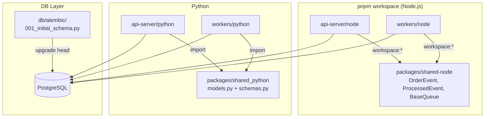

# PR: Spec 2-002 - 아키텍처 표준화 (pnpm workspace, shared-python, Alembic)

## 1. 개요 (Description)
- 후속 MQ 구현(RabbitMQ, BullMQ, MQTT)을 위한 일관된 개발 환경과 코드 표준을 수립했습니다.
- pnpm workspace로 Node.js 프로젝트를 모노레포화하고, Python/Node.js 양쪽에 공통 모델 패키지를 정립했습니다.
- Alembic을 도입하여 DB 스키마 변경을 코드로 관리하고, Makefile로 반복되는 개발 작업을 자동화했습니다.
- Resolves #Spec-2-002

## 2. 작업 상세 내용 (Changes)
- [x] **pnpm workspace 모노레포 구성**: 루트 `pnpm-workspace.yaml` + `tsconfig.base.json` 추가. `packages/shared-node(@mq/shared-node)`로 `OrderEvent`, `ProcessedEvent`, `BaseQueue` 공통 타입 추출 — `api-server/node`·`workers/node`가 `workspace:*`로 의존.
- [x] **Python 공통 모델 통합**: `packages/shared_python/`에 `models.py`(SQLModel `ProcessedEvent`)와 `schemas.py`(Pydantic `OrderEvent` + `BaseQueue` ABC)를 배치. `api-server/python`·`workers/python` import 경로 전환.
- [x] **Alembic DB 마이그레이션 도입**: `db/alembic/` 환경 구성, `init.sql` 내용을 `001_initial_schema.py`로 변환(`CREATE TABLE IF NOT EXISTS`로 멱등성 보장). `docker-compose.yml`에서 init.sql 볼륨 마운트 제거.
- [x] **Node.js DB 접근 개선**: `insertProcessedEvent()` 타입화 헬퍼 함수 도입으로 `ProcessedEvent` 타입 기반 파라미터 바인딩 적용.
- [x] **기술 결정 기록(ADR)**: `docs/tech/adr/`에 ADR-004(pnpm workspace), ADR-005(Node.js DB 접근), ADR-006(Alembic 마이그레이션) 작성.
- [x] **Makefile 추가**: `make setup`, `make migrate`, `make build-node` 등 공통 개발 작업 자동화.

## 3. 아키텍처 및 로직 흐름 (Mermaid)

## 4. 테스트 결과 및 체크리스트 (Testing Checklist)
- [x] `pnpm install` — 4개 workspace 패키지 정상 인식 (`pnpm -r ls`)
- [x] TypeScript 빌드 — `shared-node`, `api-server/node`, `workers/node` 모두 `--noEmit` 에러 없음
- [x] Python `OrderEvent` 직렬화 — `shared_python.schemas.OrderEvent` 모델 검증 통과
- [x] Alembic 마이그레이션 — `alembic upgrade head` → `001 (head)`, 3개 테이블 생성 확인

## 5. 리뷰어에게 (To Reviewers)
- **DB 초기화 방식 변경**: 기존 `docker-compose up` 시 자동 적용되던 `init.sql`이 제거됐습니다. 빈 DB를 사용하는 경우 `make migrate`(또는 `alembic upgrade head`)를 별도로 실행해야 합니다.
- **shared_python 디렉토리명**: Python은 하이픈을 모듈명으로 허용하지 않아 `shared-python` 대신 `shared_python`으로 명명했습니다.
- **Node.js DB 전략**: 현재 단계에서는 타입화 헬퍼 함수 패턴을 적용했습니다. 후속 MQ 구현에서 DB 접근 복잡도가 증가하면 Drizzle ORM 도입을 재검토합니다. (ADR-005 참고)
