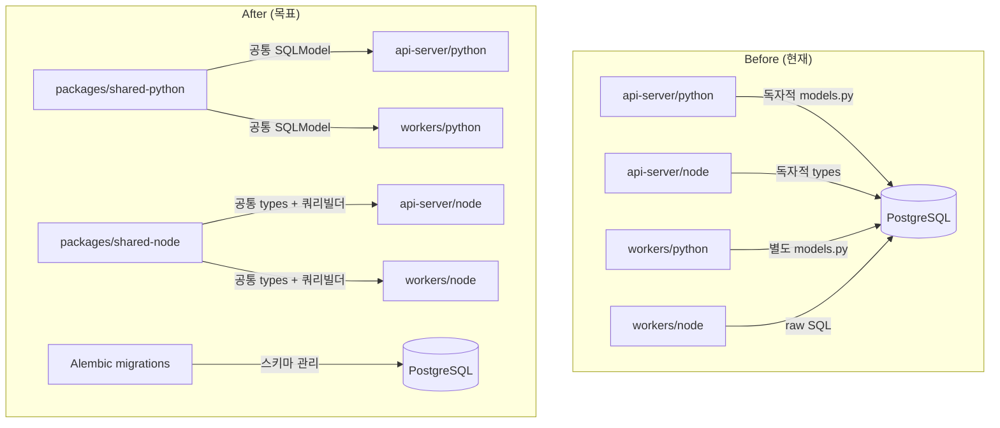

# Spec: 2-002 - 아키텍처 표준화 및 기록 (Standardization)

## 1. 개요 (Overview)
- **목표**: 후속 MQ 구현(RabbitMQ, BullMQ, MQTT)을 위한 일관된 개발 환경과 코드 표준을 수립한다. pnpm workspace로 Node.js 프로젝트를 모노레포화하고, SQLModel 공통 모델을 Python/Node 양쪽에 정립하며, Alembic을 도입하여 DB 마이그레이션을 코드로 관리한다.
- **영향 범위**: 프로젝트 루트 구조, `api-server/`, `workers/`, `db/`, `docs/tech/adr/`
- **관련 지표/이슈**: ADR-001(패키지 매니저), ADR-002(ORM 전환)에서 "향후 적용 예정"으로 남겨둔 항목들의 실행

## 2. 상세 요구사항 (Requirements)

### pnpm workspace 모노레포 구성
- [ ] 프로젝트 루트에 `pnpm-workspace.yaml` 생성 및 `api-server/node`, `workers/node` 패키지 등록
- [ ] 공통 TypeScript 설정(`tsconfig.base.json`)을 루트에 배치하고 각 패키지에서 상속
- [ ] 공통 타입/인터페이스를 `packages/shared` (또는 유사 경로)로 추출하여 workspace 내부 의존성으로 공유

### SQLModel 공통 모델 정립
- [ ] Python 측 `ProcessedEvent`, `OrderEvent` 모델을 `packages/shared-python/models.py`(혹은 적절한 공통 경로)로 통합하여 api-server와 workers가 동일 모델을 import
- [ ] Node.js 측 현재 raw SQL(`pg` 클라이언트) 사용 부분을 타입 안전한 DB 접근 패턴으로 개선 (Prisma, Drizzle, 또는 타입화된 쿼리 빌더 도입 검토)

### Alembic DB 마이그레이션 도입
- [ ] `alembic init` 으로 마이그레이션 환경 구성 (`db/migrations/` 또는 유사 경로)
- [ ] 현재 `db/init.sql`의 스키마를 Alembic 초기 마이그레이션으로 변환
- [ ] `processed_events` 테이블 등 Spec 2-001에서 추가된 스키마를 마이그레이션에 반영
- [ ] `docker-compose.yml`에서 DB 초기화 방식을 init.sql → Alembic 마이그레이션으로 전환

### 기술 결정 기록 (ADR)
- [ ] 위 결정사항들을 `docs/tech/adr/`에 ADR로 기록 (pnpm workspace 도입 배경, Node.js DB 접근 전략, Alembic 전환 이유)

## 3. 제약사항 및 비기능 요구사항
- Python 3.12+, Node.js 20+ LTS, pnpm 9.x 유지
- 기존 Kafka Worker(Spec 2-001)의 동작이 깨지지 않아야 한다 (하위 호환성)
- `docker-compose up -d && alembic upgrade head`로 DB가 정상 준비되어야 한다
- 모든 공통 모델 변경 시 Python/Node.js 양쪽에서 import 가능해야 한다

## 4. 인수 조건 (Acceptance Criteria)

- **Scenario 1**: pnpm workspace 동작 확인
  - **Given**: 프로젝트 루트에서 `pnpm install` 실행
  - **When**: `api-server/node`와 `workers/node`에서 공통 패키지를 import
  - **Then**: 빌드 에러 없이 TypeScript 컴파일 성공

- **Scenario 2**: Alembic 마이그레이션 동작 확인
  - **Given**: PostgreSQL 컨테이너가 빈 DB로 기동
  - **When**: `alembic upgrade head` 실행
  - **Then**: `orders`, `event_logs`, `processed_events` 테이블이 모두 생성됨

- **Scenario 3**: 기존 Kafka 파이프라인 하위 호환
  - **Given**: 표준화 작업 완료 후 환경 기동
  - **When**: `POST /orders`로 주문 이벤트 발행
  - **Then**: Python/Node.js Kafka Worker가 정상적으로 메시지를 소비하고 DB에 기록

## 5. 참고 자료 (References)

