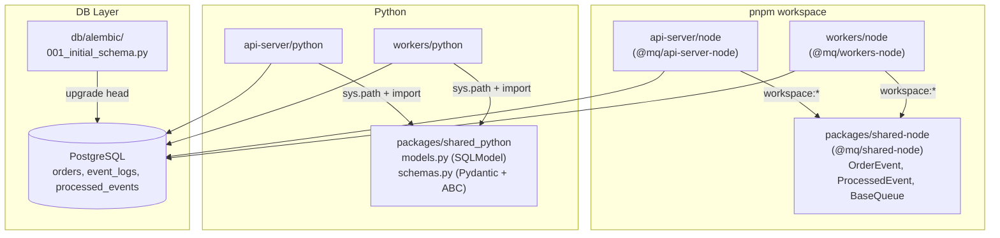
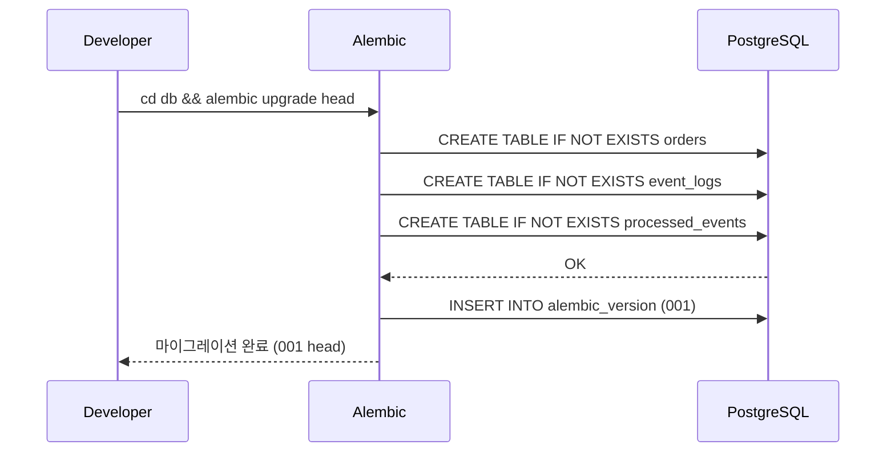

# Walkthrough: 2-002 - 아키텍처 표준화 및 기록 (Standardization)

> 이 문서는 개발 과정 전반을 실시간으로 기록하는 "개발 일지(Developer Log)"입니다.

## 1. Thought Process (사고 과정)

### pnpm workspace 구성
- 루트에 `package.json`이 없으면 pnpm이 workspace 패키지들을 인식하지 못한다는 것을 확인. `pnpm -r ls`로 검증하여 root `package.json` 추가로 해결.
- `api-server/node`의 `package.json`에 `"type": "module"`이 없어서 `verbatimModuleSyntax` 옵션이 CommonJS 파일에 ESM import를 금지하는 에러 발생. `"type": "module"` 추가로 해결.
- `packages/shared-node/package.json`의 `exports` 필드에 `types` 항목이 없으면 TypeScript가 `@mq/shared-node`를 찾지 못함. `"types": "./src/index.ts"` 추가로 해결.

### Python shared-python 패키지
- Python은 하이픈(`-`)을 모듈명으로 사용할 수 없어 `shared-python` 디렉토리를 `shared_python`으로 변경.
- `api-server/python/common/models.py`는 삭제하지 않고 `shared_python`으로의 re-export 래퍼로 변환하여 기존 코드와의 하위 호환성 유지.

### Alembic 마이그레이션
- 기존 DB에 `orders` 테이블이 이미 존재하여 `alembic upgrade head` 첫 실행 시 `DuplicateTable` 에러 발생.
- `op.create_table()` 대신 `op.execute("CREATE TABLE IF NOT EXISTS ...")` 패턴으로 교체하여 기존 DB와 빈 DB 모두에서 멱등적(idempotent)으로 동작하도록 수정.

## 2. 아키텍처 다이어그램 (Mermaid)

### pnpm workspace 패키지 의존성

### Alembic 마이그레이션 워크플로

## 3. 에러 해결 로그 (Troubleshooting)

| # | 에러 | 원인 | 해결 |
|---|------|------|------|
| 1 | `pnpm -r ls`에 workspace 패키지 미표시 | 루트 `package.json` 없음 | 루트 `package.json` 생성 |
| 2 | `TS1295: ECMAScript imports cannot be written in a CommonJS file` | `api-server/node`에 `"type":"module"` 없음 | package.json에 `"type":"module"` 추가 |
| 3 | `TS2307: Cannot find module '@mq/shared-node'` | shared-node package.json exports에 types 없음 | `"types": "./src/index.ts"` 추가 |
| 4 | `shared-python` import 불가 | Python은 하이픈을 모듈명으로 허용 안 함 | 디렉토리명 `shared_python`으로 변경 |
| 5 | `DuplicateTable: relation "orders" already exists` | 기존 DB에 init.sql로 생성된 테이블 존재 | `CREATE TABLE IF NOT EXISTS` 패턴으로 변경 |
