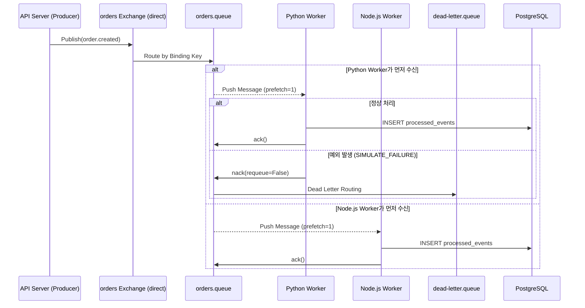

# Plan: 2-003 - RabbitMQ 구현 (RabbitMQ MVP)

## 1. 접근 방법론 (Approach)

### 핵심 설계 결정
- **Exchange 전략**: `direct` Exchange를 사용하여 `order.created` Routing Key로 메시지 라우팅. 향후 fanout 확장 시에는 Exchange 타입만 변경하면 됨.
- **Queue 전략**: `orders.queue` 하나를 Python·Node.js 워커가 **공유 컨슈밍(Competing Consumers)**. 이것이 Kafka Consumer Group과 본질적으로 다른 RabbitMQ의 철학을 드러냄.
- **DLQ 패턴**: `orders.queue` 선언 시 `x-dead-letter-exchange` 인수를 사용해 DLQ 라우팅을 선언 수준에서 정의. 별도의 애플리케이션 로직 불필요.
- **수동 ack**: `autoAck=false` (amqplib) / `no_ack=False` (aio-pika) 로 Consumer를 선언하여, 처리 성공/실패 시 명시적으로 `ack()` / `nack()` 호출. Prefetch count=1 설정으로 한 번에 하나의 메시지만 처리.
- **인위적 실패 로직**: Python 워커에서 환경변수 `SIMULATE_FAILURE=true` 설정 시 50% 확률로 강제 예외 발생 → nack → DLQ 이동 시뮬레이션.

### 라이브러리 선택
| | Python | Node.js |
|---|---|---|
| 라이브러리 | `aio-pika` (비동기) | `amqplib` |
| 이유 | 기존 aiokafka와 동일한 asyncio 패턴 일관성 | kafkajs와 동일한 패턴 일관성 |

## 2. 아키텍처 / 시스템 흐름 (Mermaid Graph)

## 3. 디렉토리/파일 변경 계획

- `[MODIFY]` `api-server/python/main.py` — RabbitMQ용 `POST /rabbitmq/orders` 엔드포인트 추가
- `[MODIFY]` `api-server/python/requirements.txt` — `aio-pika` 추가
- `[NEW]` `workers/python/rabbitmq_worker.py` — Python aio-pika Consumer (ack/nack/DLQ 포함)
- `[MODIFY]` `workers/python/requirements.txt` — `aio-pika` 추가
- `[NEW]` `workers/node/src/rabbitmq.worker.ts` — Node.js amqplib Consumer (ack/nack 포함)
- `[MODIFY]` `workers/node/package.json` — `amqplib`, `@types/amqplib` 추가

## 4. 테스트 전략 (Testing Strategy)

- **Unit Test**: 별도 작성 없음 (Worker 로직이 경량 — 통합 테스트로 대체)
- **Integration Test**:
  1. `docker compose up postgres rabbitmq -d` 로 인프라 기동
  2. Python Worker, Node.js Worker 동시 실행
  3. `POST /rabbitmq/orders` 5회 호출 → DB에 `mq_type='rabbitmq'` 레코드 수 확인
  4. `SIMULATE_FAILURE=true python rabbitmq_worker.py` 실행 후 메시지 발행 → RabbitMQ UI에서 `dead-letter.queue` 메시지 적재 확인
