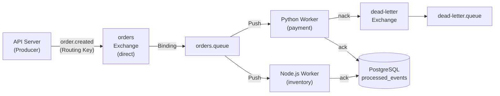

# Spec: 2-003 - RabbitMQ 구현 (RabbitMQ MVP)

## 1. 개요 (Overview)
- **목표**: RabbitMQ의 핵심 철학인 **Broker-Push 기반 전달**과 **수동 ack/nack 제어**, 그리고 처리 실패 시 **Dead Letter Queue(DLQ)** 로의 메시지 이동을 직접 구현하고 검증한다.
- **영향 범위**:
  - `api-server/python/main.py` — RabbitMQ Producer 엔드포인트 추가
  - `workers/python/rabbitmq_worker.py` — 신규 Python RabbitMQ Consumer
  - `workers/node/src/rabbitmq.worker.ts` — 신규 Node.js RabbitMQ Consumer
  - `workers/python/requirements.txt` — `aio-pika` 추가
  - `workers/node/package.json` — `amqplib`, `@types/amqplib` 추가
  - `docker-compose.yml` — RabbitMQ 서비스 이미 정의됨 (변경 불필요)
- **관련 스펙**: Spec 2-001 (Kafka MVP), Spec 2-002 (표준화)

## 2. 상세 요구사항 (Requirements)

### Producer (API Server - Python)
- [x] `POST /rabbitmq/orders` 엔드포인트를 추가하여 `orders` Exchange로 메시지 발행
- [x] Exchange 타입: `direct`, Routing Key: `order.created`
- [x] 메시지 포맷: 기존 `OrderEvent` (shared_python) 사용

### Consumer — Python Worker (`payment-group` 역할)
- [x] `aio-pika`를 사용하여 `orders.queue` 바인딩 후 메시지 수신
- [x] 수동 ack 구현: 정상 처리 시 `ack()`, 예외 발생 시 `nack(requeue=False)`
- [x] `nack` 된 메시지가 `dead-letter.queue`로 자동 이동하도록 DLQ 설정
- [x] 처리 결과를 `processed_events` 테이블에 저장 (mq_type=`rabbitmq`)

### Consumer — Node.js Worker (`inventory-group` 역할)
- [x] `amqplib`를 사용하여 `orders.queue` 바인딩 후 메시지 수신
- [x] 수동 ack 구현: 정상 처리 시 `ack()`, 예외 발생 시 `nack(false, false)`
- [x] DLQ 선언 공유 (Python 워커와 동일 큐 사용)
- [x] 처리 결과를 `processed_events` 테이블에 저장 (mq_type=`rabbitmq`)

### DLQ 설정
- [x] `orders.queue` 선언 시 `x-dead-letter-exchange` 인수로 `dead-letter.exchange` 지정
- [x] `dead-letter.queue`에 바인딩하여 실패 메시지 수집

## 3. 제약사항 및 비기능 요구사항
- Python: `aio-pika` 비동기 라이브러리 사용 (동기 `pika` 미사용)
- Node.js: `amqplib` 사용 (기존 kafkajs와 동일한 패턴으로 Worker 파일 구성)
- 두 Consumer가 같은 큐(`orders.queue`)를 컨슈밍 — RabbitMQ에서는 메시지가 **하나의 Consumer에만** 전달됨을 확인 (Kafka와의 철학 차이 검증)
- DB 저장 로직은 Spec 2-002에서 확립한 패턴(`ProcessedEvent` SQLModel / pg 헬퍼) 그대로 재사용

## 4. 인수 조건 (Acceptance Criteria)

- **Scenario 1**: 정상 메시지 처리 및 DB 저장
  - **Given**: Docker Compose로 RabbitMQ와 PostgreSQL이 실행 중이며, Python/Node.js 워커가 `orders.queue`를 구독 중
  - **When**: `POST /rabbitmq/orders` API 호출로 메시지 발행
  - **Then**: Python 또는 Node.js 워커 **둘 중 하나만** 메시지를 수신·처리하고, `processed_events` 테이블에 `mq_type='rabbitmq'` 레코드가 저장됨

- **Scenario 2**: 실패 메시지 DLQ 이동 확인
  - **Given**: Python 워커 내부에 인위적인 예외 발생 조건 추가 (예: 특정 order_id 패턴 시 강제 raise)
  - **When**: 해당 메시지를 발행
  - **Then**: RabbitMQ 관리자 UI(http://localhost:15672)에서 `dead-letter.queue`에 해당 메시지가 쌓인 것을 눈으로 확인

- **Scenario 3**: Kafka와의 철학 차이 검증
  - **Given**: Python Worker(payment)와 Node.js Worker(inventory) 모두 `orders.queue` 구독 중
  - **When**: 5개의 주문 메시지를 연속 발행
  - **Then**: 메시지가 두 워커 사이에 **분산**되어 처리되고, 각 메시지는 **단 하나의 워커**만 처리함 (Kafka처럼 두 그룹 모두에게 전달되는 것이 아님)

## 5. 참고 자료 (References)

- [aio-pika docs](https://aio-pika.readthedocs.io/)
- [amqplib GitHub](https://github.com/amqp-node/amqplib)
- [RabbitMQ Dead Letter Exchanges](https://www.rabbitmq.com/dlx.html)
