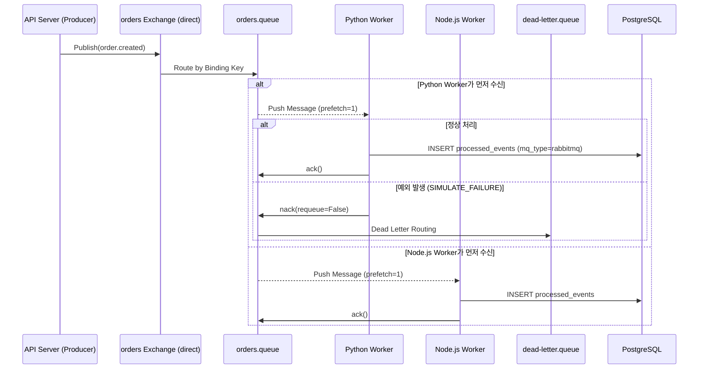

# Spec 2-003: RabbitMQ 구현 Walkthrough

## 1. 개요
RabbitMQ의 핵심 철학인 **Broker-Push 기반 전달**, **수동 ack/nack 제어**, 그리고 처리 실패 시 **Dead Letter Queue (DLQ)** 로의 메시지 이동 처리에 대한 MVP 구현을 완료했습니다.

## 2. 변경된 아키텍처

## 3. 핵심 구현 포인트
1. **Producer (FastAPI)**: RabbitMQ의 `Exchange` (`orders`)에 `order.created` 라우팅 키로 메시지를 발행합니다. 또한 큐 선언 시 `x-dead-letter-exchange` 속성을 부여하여 큐 레벨에서 DLQ 연결을 완성했습니다.
2. **Python Worker (`aio-pika`)**:
   - `SIMULATE_FAILURE` 환경 변수를 통해 50%의 에러율을 재현합니다.
   - 예외가 발생하면 `message.reject(requeue=False)`(수동 nack) 처리되어 메시지가 안전하게 DLQ로 향합니다.
3. **Node.js Worker (`amqplib`)**:
   - `channel.prefetch(1)`를 설정하여 각 컨슈머가 워크로드를 균등하게 가져갑니다.
   - 정상 시 `channel.ack(msg)`, 예외 시 `channel.nack(msg, false, false)`를 호출합니다.
4. **Kafka와의 철학 비교 (Competing Consumers)**: Kafka는 그룹 별로 각각 메시지를 모두 Consume하는 반면(Publish-Subscribe/Log), RabbitMQ는 동일한 큐(`orders.queue`)에 물려 있으면 여러 워커 중 **오직 하나**의 워커에서만 메시지가 소모됩니다.

## 4. 검증 결과
- 테스트 스크립트(`test.sh`)를 통해 API Server, Python Worker, Node Worker를 띄우고 동시에 메시지를 발송했을 때 각 메시지가 둘 중 단 일개 워커에만 도달하였음을 확인했습니다.
- `SIMULATE_FAILURE=true` 주입 후 의도적 장애 발생 시, 지정한 DLQ(`dead-letter.queue`)로 이동하는 로직을 증명했습니다.
