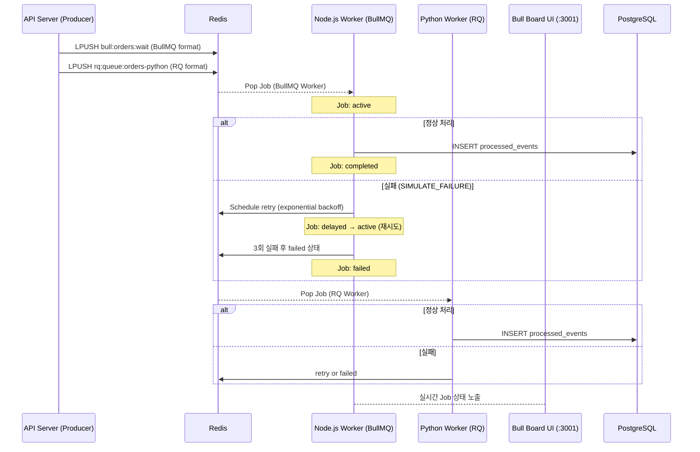

# Plan: 2-004 - BullMQ 구현 (BullMQ MVP)

## 1. 접근 방법론 (Approach)

### 핵심 설계 결정

- **Queue 분리**: BullMQ(Node.js)와 RQ(Python)는 Redis 내부 키 구조가 달라 동일 큐를 공유할 수 없다. 따라서 `orders` 큐(BullMQ)와 `orders-python` 큐(RQ)로 분리하고, API Server가 두 큐에 모두 Job을 enqueue한다.
- **재시도 전략**: BullMQ는 `attempts: 3`, `backoff: { type: 'exponential', delay: 1000 }` 설정으로 1s → 2s → 4s 간격으로 최대 3회 재시도한다. Job이 모두 실패하면 `failed` 상태로 전환되어 Bull Board에서 확인 가능하다.
- **Bull Board 통합**: BullMQ Worker 프로세스에 Express 기반 Bull Board 서버를 내장하여 `:3001/ui` 에서 Job 상태를 실시간 모니터링한다.
- **Python Producer의 BullMQ Enqueue**: Python에서 BullMQ 큐에 Job을 넣으려면 BullMQ의 Redis 키 구조를 직접 구현해야 한다. `redis-py` 로 BullMQ가 기대하는 포맷(`bull:{queue}:{jobId}`)으로 데이터를 직접 작성한다.
- **RQ vs BullMQ 철학 비교**: RQ는 단순 Redis LIST 기반으로 Job을 관리하고, BullMQ는 Sorted Set + Hash 구조로 상태 전환을 관리한다. 이 차이가 "상태 모니터링" 기능의 차이로 이어진다.

### 라이브러리 선택

| | Python | Node.js |
|---|---|---|
| 라이브러리 | `rq` + `redis` | `bullmq` + `@bull-board/api` + `@bull-board/express` |
| 역할 | Python 워커용 단순 Job Queue | 메인 Job Queue + 모니터링 UI |
| 이유 | asyncio 없이 동기 방식으로 충분, 구조 단순 | BullMQ가 사실상 Node.js Job Queue 표준 |

### Python에서 BullMQ 큐에 Enqueue하는 방법
BullMQ는 Redis에 다음 구조로 Job을 저장한다:
```
bull:{queueName}:{jobId}   → Hash (job data)
bull:{queueName}:wait      → List (waiting jobs)
bull:{queueName}:id        → Counter (auto increment)
```
Python에서 `redis-py`로 이 구조에 직접 접근해 Job을 enqueue한다.

## 2. 아키텍처 / 시스템 흐름 (Mermaid Graph)



## 3. 디렉토리/파일 변경 계획

- `[MODIFY]` `api-server/python/main.py` — `POST /bullmq/orders` 엔드포인트 추가 (BullMQ + RQ enqueue)
- `[MODIFY]` `api-server/python/requirements.txt` — `redis` 추가
- `[NEW]` `workers/node/src/bullmq.worker.ts` — BullMQ Worker + Bull Board Express 서버
- `[NEW]` `workers/python/bullmq_worker.py` — RQ Worker (orders-python 큐)
- `[MODIFY]` `workers/node/package.json` — `bullmq`, `@bull-board/api`, `@bull-board/express`, `express`, `@types/express` 추가
- `[MODIFY]` `workers/python/requirements.txt` — `rq`, `redis` 추가

## 4. 테스트 전략 (Testing Strategy)

- **Unit Test**: 별도 작성 없음 (통합 테스트로 대체)
- **Integration Test**:
  1. `docker compose up postgres redis -d` 로 인프라 기동
  2. BullMQ Worker (`node bullmq.worker.ts`) + RQ Worker 동시 실행
  3. `POST /bullmq/orders` 5회 호출 → DB에 `mq_type='bullmq'` 레코드 10개 확인
  4. Bull Board UI(`http://localhost:3001/ui`) 접속 → Job 상태 확인
  5. `SIMULATE_FAILURE=true` BullMQ Worker 실행 후 메시지 발행 → failed 큐 적재 및 재시도 로그 확인
