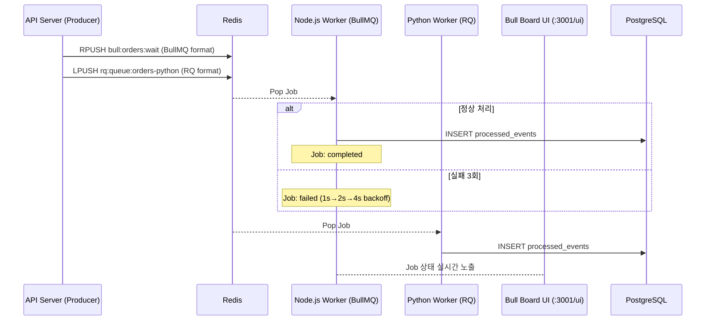

## 1. 개요

Spec 2-004: BullMQ/RQ 기반 Job Queue MVP 구현.

Redis를 백엔드로 사용하는 두 Job Queue 라이브러리를 동일 시나리오에 적용하여,
**Job 상태 관리**와 **지수적 재시도(Exponential Backoff)** 동작을 직접 검증합니다.

## 2. 변경 내용

### 신규 파일
- `workers/node/src/bullmq.worker.ts` — BullMQ Worker + Bull Board UI (`:3001/ui`)
- `workers/python/bullmq_worker.py` — RQ Worker (`orders-python` 큐)
- `specs/spec-2-004-bullmq-impl/` — 스펙 문서 일체

### 수정 파일
- `api-server/python/main.py`
  - `BullMQProducer` 클래스 추가: redis-py로 BullMQ 키 포맷 직접 작성 + RQ enqueue 동시 수행
  - `POST /bullmq/orders` 엔드포인트 추가
  - Kafka/RabbitMQ startup 실패 시 warn 후 계속 (다른 MQ 없이 독립 동작 보장)
- `workers/node/package.json` — `bullmq`, `@bull-board/api`, `@bull-board/express`, `express` 추가
- `workers/python/requirements.txt` — `rq`, `redis`, `sqlmodel`, `psycopg2-binary` 추가
- `api-server/python/requirements.txt` — `redis>=4.0`, `rq>=2.0` 추가

## 3. 아키텍처



## 4. 테스트 결과

**Scenario 1 — 정상 처리:**
```sql
SELECT group_id, mq_type, COUNT(*) FROM processed_events
GROUP BY group_id, mq_type;
-- inventory-group | bullmq | 15
-- payment-group   | bullmq |  6
```

**Scenario 2 — SIMULATE_FAILURE=true (BullMQ 재시도):**
```
bull:orders:21 Redis 상태:
  atm: 3 (3번 시도)
  failedReason: [SIMULATE_FAILURE] Intentional failure for job #21
  stacktrace: 3개 (각 시도별)
  opts: {"attempts": 3, "backoff": {"type": "exponential", "delay": 1000}}
```
→ 1s → 2s → 4s 지수 간격으로 3회 재시도 후 `failed` 상태로 Redis에 영구 보존 확인.

## 5. 리뷰어에게

- **BullMQ vs RQ 큐 분리**: 두 라이브러리는 Redis 키 구조가 달라 공유 불가. `orders` (BullMQ) + `orders-python` (RQ) 로 분리.
- **Python → BullMQ Enqueue**: 공식 Python 클라이언트 없음. `redis-py` + BullMQ 내부 키 포맷 직접 구현 (`bull:{queue}:{id}` HMSET + `bull:{queue}:wait` RPUSH).
- **macOS fork 이슈**: RQ는 `fork()` 기반. macOS에서 `OBJC_DISABLE_INITIALIZE_FORK_SAFETY=YES` 필요. Linux(컨테이너)에서는 불필요.
- **SQLAlchemy lazy 생성**: `fork()` 후 연결 충돌 방지를 위해 엔진을 함수 내부에서 `_get_engine()` 로 lazy 생성.
