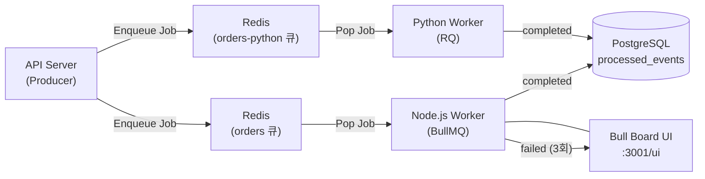

# Spec: 2-004 - BullMQ 구현 (BullMQ MVP)

## 1. 개요 (Overview)
- **목표**: Redis 기반의 Job Queue인 BullMQ의 핵심 철학인 **Job 상태 전환(waiting → active → completed/failed)** 과 **지수적 재시도(Exponential Backoff Retry)** 를 직접 구현하고 검증한다. 또한 Bull Board UI를 통해 Job 상태를 시각적으로 모니터링하는 과정을 체득한다.
- **영향 범위**:
  - `api-server/python/main.py` — BullMQ Producer 엔드포인트 추가 (Redis에 Job 직접 enqueue)
  - `workers/node/src/bullmq.worker.ts` — 신규 Node.js BullMQ Consumer + Bull Board 서버
  - `workers/python/bullmq_worker.py` — 신규 Python RQ Consumer
  - `workers/node/package.json` — `bullmq`, `@bull-board/api`, `@bull-board/express` 추가
  - `workers/python/requirements.txt` — `rq`, `redis` 추가
  - `api-server/python/requirements.txt` — `redis` 추가
  - `docker-compose.yml` — Redis 서비스 이미 정의됨 (변경 불필요)
- **관련 스펙**: Spec 2-003 (RabbitMQ MVP)

## 2. 상세 요구사항 (Requirements)

### Producer (API Server - Python)
- [ ] `POST /bullmq/orders` 엔드포인트 추가
- [ ] BullMQ 포맷으로 Redis에 Job을 직접 Enqueue (`orders` 큐 이름 사용)
- [ ] 메시지 포맷: 기존 `OrderEvent` (shared_python) 재사용

### Consumer — Node.js Worker (BullMQ)
- [ ] `bullmq` 의 `Worker` 클래스로 `orders` 큐를 구독
- [ ] `concurrency: 1` 설정으로 한 번에 하나의 Job만 처리
- [ ] **지수적 재시도**: `attempts: 3`, `backoff: { type: 'exponential', delay: 1000 }` 설정
- [ ] `SIMULATE_FAILURE` 환경변수 기반 50% 강제 실패 로직 구현 → `Error` throw 시 BullMQ가 자동으로 retry 수행
- [ ] 최종 성공 시 `processed_events` 테이블에 저장 (`mq_type='bullmq'`, `group_id='inventory-group'`)
- [ ] **Bull Board UI** 서버 내장 — `http://localhost:3001/ui` 에서 Job 상태 시각적 모니터링

### Consumer — Python Worker (RQ)
- [ ] `rq` 의 `Worker` 클래스로 `orders-python` 큐를 구독
- [ ] 정상 처리 시 `processed_events` 테이블에 저장 (`mq_type='bullmq'`, `group_id='payment-group'`)
- [ ] `SIMULATE_FAILURE` 환경변수 기반 50% 강제 실패 로직 구현 → `Exception` raise 시 RQ가 자동 retry

### Job 구조
- `orders` 큐 (BullMQ, Node.js Worker 담당)
- `orders-python` 큐 (RQ, Python Worker 담당)
- API Server가 두 큐 모두에 Job을 enqueue

## 3. 제약사항 및 비기능 요구사항
- Node.js: `bullmq` 사용 (Redis 6+ 필요, docker-compose의 redis:7 충족)
- Python: `rq` 사용 (순수 Redis 기반 단순 Job Queue)
- BullMQ와 RQ는 Redis 내 키 구조가 달라 같은 큐를 공유할 수 없음 → 별도 큐로 분리
- Bull Board는 Express 서버로 Worker와 동일 프로세스에서 실행 (`:3001/ui`)
- DB 저장 로직은 기존 `ProcessedEvent` 패턴 그대로 재사용

## 4. 인수 조건 (Acceptance Criteria)

- **Scenario 1**: 정상 Job 처리 및 DB 저장
  - **Given**: Redis와 PostgreSQL이 실행 중이며, BullMQ Worker와 RQ Worker가 각각 큐를 구독 중
  - **When**: `POST /bullmq/orders` 5회 호출
  - **Then**: `processed_events` 테이블에 `mq_type='bullmq'` 레코드 10개 저장됨 (inventory 5 + payment 5)

- **Scenario 2**: 지수적 재시도 후 최종 실패 (BullMQ)
  - **Given**: `SIMULATE_FAILURE=true` 로 BullMQ Worker 실행 (100% 실패)
  - **When**: 메시지 발행
  - **Then**: Bull Board UI(`/ui`)에서 Job이 `active → failed (attempts: 3)` 상태로 전환되는 것을 확인. 재시도 간격이 1s → 2s → 4s 로 지수적으로 증가함을 로그로 확인.

- **Scenario 3**: RabbitMQ와의 철학 차이 검증
  - **Given**: BullMQ Worker 실행 중
  - **When**: 메시지 발행 후 Worker를 일시 정지
  - **Then**: Job이 `waiting` 상태로 Redis에 보존됨 (RabbitMQ처럼 사라지지 않음). Worker 재기동 시 이어서 처리됨.

## 5. 참고 자료 (References)

- [BullMQ 공식 문서](https://docs.bullmq.io/)
- [Bull Board GitHub](https://github.com/felixmosh/bull-board)
- [RQ 공식 문서](https://python-rq.org/)
