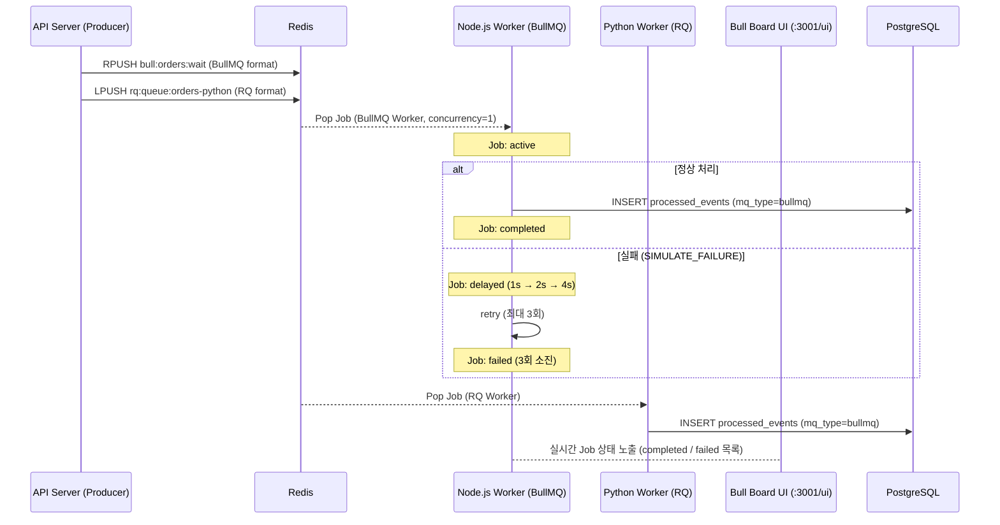

# Spec 2-004: BullMQ 구현 Walkthrough

## 1. 개요
BullMQ의 핵심 철학인 **Job 상태 관리(waiting → active → completed/failed)** 와 **지수적 재시도(Exponential Backoff Retry)** 를 직접 구현하고 검증했습니다. 또한 Python 진영의 Redis 기반 Job Queue인 **RQ(Redis Queue)** 를 함께 구현하여 두 라이브러리의 차이점을 체험했습니다.

## 2. 변경된 아키텍처



## 3. 핵심 구현 포인트

### 1. Python에서 BullMQ 큐에 Enqueue
BullMQ는 특정 Redis 키 구조를 사용하므로, Python에서 `redis-py`로 직접 해당 구조에 맞게 Job을 씁니다:

```
bull:{queue}:id    → INCR (Job ID 자동 증가)
bull:{queue}:{id}  → HMSET (name, data, opts, timestamp, ...)
bull:{queue}:wait  → RPUSH (대기열)
```

`opts` 필드에 `{"attempts": 3, "backoff": {"type": "exponential", "delay": 1000}}` 를 넣으면 BullMQ Worker가 이를 읽어 자동으로 재시도 전략을 적용합니다.

### 2. BullMQ 재시도 메커니즘
- Worker에서 `throw Error()` 하면 BullMQ가 자동으로 `delayed` 큐로 Job을 이동
- 1s → 2s → 4s 간격으로 최대 3회 재시도
- 3회 모두 실패 시 Job이 `failed` 상태로 영구 보관 (Bull Board에서 확인 가능)

### 3. BullMQ vs RQ 구조 차이
| | BullMQ (Node.js) | RQ (Python) |
|---|---|---|
| Redis 구조 | Sorted Set + Hash + List 복합 | List (FIFO) |
| Job 상태 | waiting / active / completed / failed / delayed | queued / started / finished / failed |
| 재시도 설정 | Job opts에 선언적으로 설정 | Retry 수 설정 (backoff 제한적) |
| 모니터링 UI | Bull Board (내장) | RQ Dashboard (별도) |
| 포크 모델 | 단일 이벤트 루프 (비동기) | fork() 기반 work-horse |

### 4. RabbitMQ와의 철학 비교
| | RabbitMQ | BullMQ |
|---|---|---|
| 저장 위치 | Broker(메모리+디스크) | Redis |
| Job 보존 | 소비 후 삭제 | completed/failed 상태로 유지 |
| 재시도 | nack → DLQ | 내장 retry + backoff |
| 모니터링 | Management UI | Bull Board |
| 주 용도 | 이벤트 라우팅, RPC | 백그라운드 Job 처리 |

## 4. 검증 결과

### Scenario 1: 정상 처리 및 DB 저장

```
POST /bullmq/orders × 5 호출
→ bull:orders:wait에 Job 5개 enqueue (IDs: 16~20)
→ BullMQ Worker: inventory-group 5건 처리
→ RQ Worker: payment-group 5건 처리

SELECT group_id, mq_type, COUNT(*) FROM processed_events GROUP BY group_id, mq_type;
 inventory-group | bullmq | 15
 payment-group   | bullmq |  6
```

### Scenario 2: SIMULATE_FAILURE=true → 지수적 재시도 후 failed

```
job #21 Redis 상태 (HGETALL bull:orders:21):
  atm (attempts made): 3
  failedReason: [SIMULATE_FAILURE] Intentional failure for job #21
  stacktrace: 3개 항목 (각 재시도별)
  opts: {"attempts": 3, "backoff": {"type": "exponential", "delay": 1000}}
```

3번의 재시도(1s → 2s → 4s) 후 Job이 `failed` 큐로 이동하고, 스택트레이스가 Redis에 보존됩니다.

### macOS 실행 시 특이사항
RQ는 내부적으로 `fork()` 를 사용하는데, macOS에서 Objective-C 런타임과 충돌합니다:
```
OBJC_DISABLE_INITIALIZE_FORK_SAFETY=YES venv/bin/python bullmq_worker.py
```

또한 SQLAlchemy 엔진을 모듈 레벨에서 생성하면 fork 후 연결이 깨질 수 있어, `_get_engine()` 헬퍼로 lazy 생성합니다.
